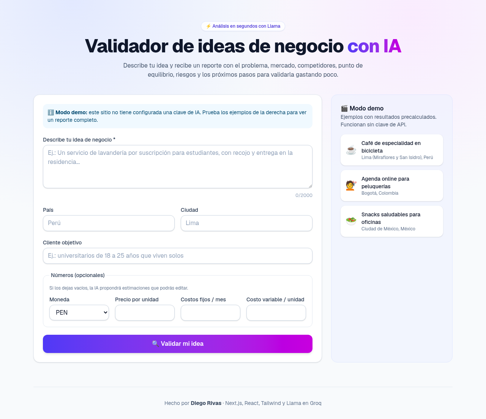
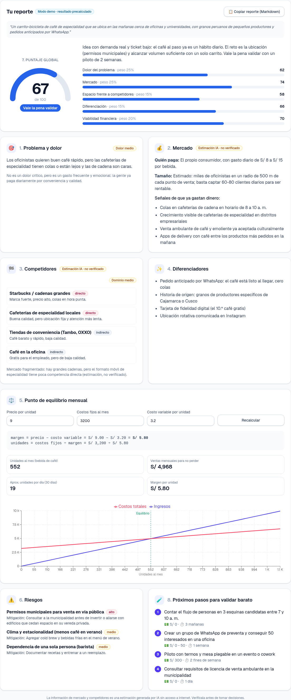

# 💡 Validador de ideas de negocio con IA

Aplicación web que analiza una idea de negocio y devuelve un reporte estructurado:

1. **Problema** que resuelve y qué tan real es el dolor
2. **Mercado**: quién paga y señales de que ya gastan dinero
3. **Competidores** y qué tan dominado está el mercado
4. **Diferenciadores**
5. **Punto de equilibrio** calculado en código con una fórmula transparente (si faltan datos, la IA propone estimaciones marcadas que puedes editar y recalcular)
6. **Riesgos** con su mitigación
7. **Puntaje 0-100** global y por dimensión
8. **Próximos pasos** para validar gastando poco

Incluye **modo demo** con 3 ideas de ejemplo y resultados precalculados, así funciona aunque no haya clave de API. También puedes **copiar el reporte en Markdown**.

> ⚠️ La información de mercado y competidores la genera un LLM sin acceso a internet: son **estimaciones, no datos verificados**.

| Formulario | Reporte |
| --- | --- |
|  |  |

Proyecto de portafolio de **Diego Rivas**, hecho para aprender React. El código tiene comentarios en español que explican los conceptos clave.

## 🧱 Tecnologías

- [Next.js](https://nextjs.org) (App Router) + React + TypeScript
- Tailwind CSS
- [Groq](https://console.groq.com) (API compatible con OpenAI) con el modelo Llama `openai/gpt-oss-120b`
- [zod](https://zod.dev) para validar la entrada del usuario y el JSON del LLM
- [recharts](https://recharts.org) para el gráfico de punto de equilibrio
- [Vitest](https://vitest.dev) para los tests

## 🗺️ Arquitectura

```
Navegador (Client Components)                 Servidor (Vercel)
┌──────────────────────────────┐   POST     ┌──────────────────────────────┐
│ Validador.tsx (estado)       │ ─────────▶ │ app/api/validar/route.ts     │
│  ├ FormularioIdea            │  /api/     │  1. límite por IP            │
│  ├ Modo demo (sin servidor)  │  validar   │  2. valida entrada (zod)     │
│  └ Reporte                   │ ◀───────── │  3. llama a Groq (clave env) │
│     ├ MedidorPuntaje         │   JSON     │  4. valida JSON (zod)        │
│     ├ TarjetaSeccion ×8      │            └──────────────┬───────────────┘
│     └ PuntoEquilibrio+gráfico│                           ▼
└──────────────────────────────┘                   api.groq.com (Llama)
```

- **La clave `GROQ_API_KEY` solo existe en el servidor.** El navegador llama a nuestra ruta `/api/validar`, nunca directamente a Groq. `src/lib/groq.ts` importa `server-only`, así que el build falla si alguien lo usa desde el cliente.
- **El punto de equilibrio y el puntaje global se calculan en código** (`src/lib/equilibrio.ts`, `src/lib/puntaje.ts`), no los inventa la IA:
  - Margen de contribución = Precio − Costo variable por unidad
  - Unidades de equilibrio = Costos fijos mensuales ÷ Margen de contribución
  - Puntaje global = promedio ponderado de las 5 dimensiones (pesos visibles en la UI)

### Estructura de carpetas

```
src/
├── app/
│   ├── layout.tsx            # Layout raíz (Server Component)
│   ├── page.tsx              # Página principal (Server Component)
│   ├── globals.css           # Tailwind + clases reutilizables
│   └── api/validar/route.ts  # Ruta de servidor que llama a la IA
├── components/               # Componentes de React (UI)
│   ├── Validador.tsx         # Estado principal ("use client")
│   ├── FormularioIdea.tsx    # Formulario controlado
│   ├── Reporte.tsx           # Arma las 8 secciones
│   ├── MedidorPuntaje.tsx    # Gauge en SVG
│   ├── BarrasDimensiones.tsx
│   ├── TarjetaSeccion.tsx    # Tarjeta genérica (props + children)
│   ├── PuntoEquilibrio.tsx   # Datos editables + fórmula
│   ├── GraficoEquilibrio.tsx # recharts
│   ├── BotonCopiar.tsx
│   └── PiePagina.tsx
└── lib/                      # Lógica sin UI (fácil de testear)
    ├── esquemas.ts           # Esquemas zod + tipos
    ├── groq.ts               # Cliente de Groq (solo servidor)
    ├── prompt.ts             # Instrucciones para el LLM
    ├── equilibrio.ts         # Fórmula de punto de equilibrio
    ├── puntaje.ts            # Puntaje global ponderado
    ├── limiteSolicitudes.ts  # Rate limiting por IP
    ├── markdown.ts           # Exportar reporte a Markdown
    └── demos.ts              # Ejemplos del modo demo
tests/                        # Tests con Vitest (Groq simulado)
```

## 💻 Ejecutar en local

Requisitos: Node.js 20 o superior.

```bash
npm install
cp .env.example .env.local   # y pega tu GROQ_API_KEY (opcional: sin clave funciona el modo demo)
npm run dev                  # abre http://localhost:3000
```

Otros comandos:

```bash
npm test         # tests (la ruta se prueba con una respuesta de Groq simulada)
npm run lint     # revisa el estilo del código
npm run build    # build de producción
```

## 🚀 Publicar en Vercel paso a paso

1. **Consigue una clave gratuita de Groq**: entra a [console.groq.com](https://console.groq.com), crea una cuenta, ve a **API Keys → Create API Key** y copia la clave (empieza con `gsk_`). Guárdala; no la compartas.
2. **Crea un repositorio en GitHub**: en [github.com/new](https://github.com/new) crea un repo vacío (por ejemplo `validador-ideas`), sin README ni .gitignore.
3. **Sube el código** desde la carpeta del proyecto:
   ```bash
   git init
   git add .
   git commit -m "Validador de ideas de negocio con IA"
   git branch -M main
   git remote add origin https://github.com/TU_USUARIO/validador-ideas.git
   git push -u origin main
   ```
   El archivo `.gitignore` ya evita subir `node_modules`, `.next` y `.env.local` (tu clave).
4. **Importa el proyecto en Vercel**: entra a [vercel.com/new](https://vercel.com/new), inicia sesión con GitHub, elige el repo y pulsa **Import**. Vercel detecta Next.js solo; no hay que cambiar nada.
5. **Configura la variable de entorno**: antes de *Deploy* (o después en **Settings → Environment Variables**), agrega `GROQ_API_KEY` con tu clave. Opcionales: `GROQ_MODEL`, `RATE_LIMIT_POR_MINUTO`.
6. **Deploy**. Si agregas o cambias la variable después, ve a **Deployments → ⋯ → Redeploy** para que se aplique.

Sin `GROQ_API_KEY` el sitio igual funciona en **modo demo** y muestra un mensaje amigable al intentar un análisis real.

## 📝 Notas y limitaciones

- El límite de solicitudes (5 por minuto por IP) se guarda en memoria: en Vercel cada instancia tiene la suya, así que es aproximado. Para producción real usa Redis (por ejemplo Upstash).
- El modelo se puede cambiar con `GROQ_MODEL` si Groq retira o cambia el modelo por defecto (revisa [console.groq.com/docs/models](https://console.groq.com/docs/models)).
- Los análisis de la IA son orientativos; no reemplazan una investigación de mercado.

---

Hecho por **Diego Rivas**.
